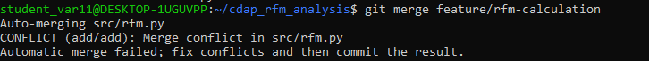
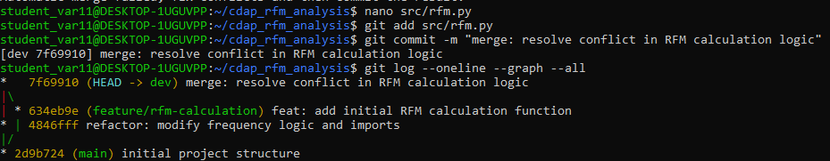

# Corporate Data Analytics Platform (CDAP)

## Лабораторная работа №1  
Работа с Git и GitHub

### ФИО: Головин Артём Андреевич
### Группа: БД-251м  
### Вариант: 11  

---

## Бизнес-задача

Сегментация покупателей с использованием RFM-анализа  
(Recency, Frequency, Monetary).

---

## Проектная задача

Реализован Python-скрипт расчета RFM-метрик:
- Recency — давность последней покупки
- Frequency — количество покупок
- Monetary — сумма покупок

---

## Структура проекта

- data/ — исходные данные
- src/ — исходный код
- notebooks/ — аналитические ноутбуки
- docs

---

## Работа с Git

- Создана ветка dev
- Создана ветка feature/rfm-calculation
- Смоделирован конфликт
- Конфликт успешно разрешён
- Выполнено слияние dev → main через Pull Request

---

## Скриншоты

### Возникновение конфликта

### Разрешение конфликта

