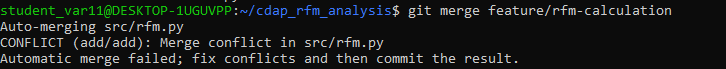
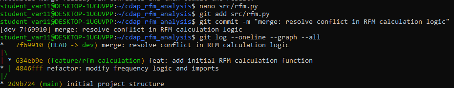
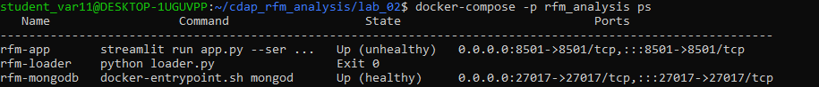
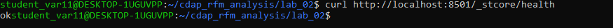
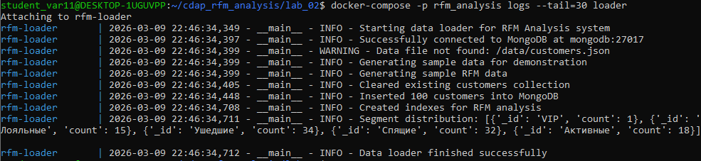
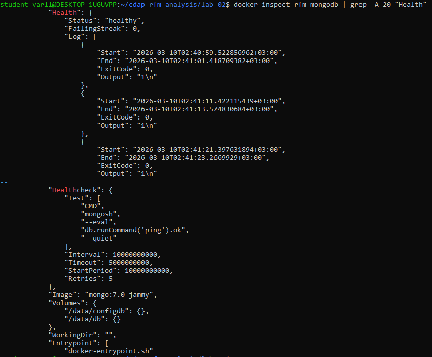
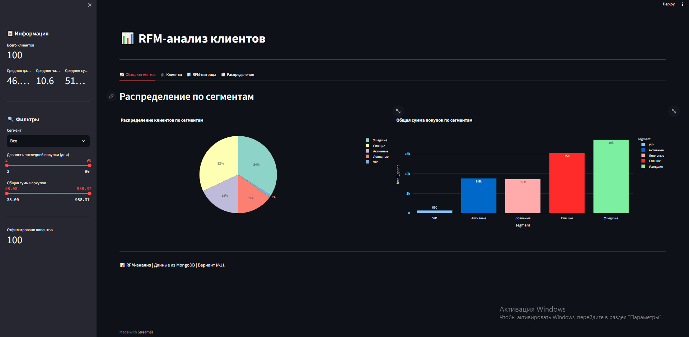

# Corporate Data Analytics Platform (CDAP)

## Лабораторная работа №1  
Работа с Git и GitHub

### ФИО: Головин Артём Андреевич
### Группа: БД-251м  
### Вариант: 11
### Датасет для анализа: Online Retail II  

---

## Бизнес-задача

Сегментация покупателей с использованием RFM-анализа  
(Recency, Frequency, Monetary).

---

## Проектная задача

Реализован Python-скрипт расчета RFM-метрик:
- Recency — давность последней покупки
- Frequency — количество покупок
- Monetary — сумма покупок

---

## Структура проекта

- data/ — исходные данные
- src/ — исходный код
- notebooks/ — аналитические ноутбуки
- docs

---

## Работа с Git

- Создана ветка dev
- Создана ветка feature/rfm-calculation
- Смоделирован конфликт
- Конфликт успешно разрешён
- Выполнено слияние dev → main через Pull Request

---

## Скриншоты

### Возникновение конфликта

### Разрешение конфликта

## Лабораторная работа №2 — Docker-контейнеризация RFM-аналитики

### Архитектура решения (вариант 11)
В соответствии с вариантом №11 реализована микросервисная архитектура для RFM-анализа:

| Сервис | Роль | Технологии |
|--------|------|------------|
| **mongodb** | База данных для хранения информации о клиентах | MongoDB 7.0 |
| **loader** | Init-контейнер для загрузки данных (ETL) | Python, pandas, pymongo |
| **app** | Streamlit дашборд для визуализации RFM-аналитики | Streamlit, plotly, pandas |

### Техническое задание варианта №11
- ✅ **Healthcheck для MongoDB** с использованием команды:
  mongosh --eval 'db.runCommand("ping").ok' --quiet
- Порядок запуска: MongoDB → Loader → App (с depends_on и condition: service_healthy)

- Данные сохраняются в named volume rfm-mongodb-data

- Автоматическое создание индексов для RFM-анализа

### Структура проекта (ЛР2)

cdap_rfm_analysis
├── lab_02/                         # Docker-конфигурация
│   ├── docker-compose.yml          # Оркестрация сервисов
│   ├── .env.example                # Шаблон переменных окружения
│   ├── .dockerignore               # Исключения для Docker
│   ├── loader/                      # ETL-сервис загрузки данных
│   │   ├── Dockerfile
│   │   ├── requirements.txt
│   │   └── loader.py
│   └── app/                          # Streamlit дашборд
│       ├── Dockerfile
│       ├── requirements.txt
│       └── app.py
├── data/                            # Данные из ЛР1 (опционально)
├── docs/                             # Скриншоты выполнения
└── README.md                         # Документация проекта

### Инструкция по запуску

#### Перейти в папку с Docker-конфигурацией
cd ~/cdap_rfm_analysis/lab_02

#### Настроить окружение
cp .env.example .env

#### Запустить сервисы
docker-compose -p rfm_analysis up -d

#### Проверить статус
docker-compose -p rfm_analysis ps

### Результаты выполнения ЛР2 (скриншоты)

#### 1. Статус контейнеров

*Все сервисы запущены: MongoDB (healthy), Loader (exit 0), App (up). Техническое задание по healthcheck MongoDB выполнено.*

 

#### 2. Health check приложения

*Streamlit приложение отвечает на запросы healthcheck: статус "ok" подтверждает работоспособность.*

 

#### 3. Логи успешной загрузки данных

*Loader создал 100 тестовых клиентов, загрузил их в MongoDB, создал индексы для RFM-анализа и завершился успешно (Exit 0). Распределение по сегментам: VIP (1), Лояльные (15), Активные (18), Спящие (32), Ушедшие (34).*

 

#### 4. Подтверждение healthcheck MongoDB (техзадание)

*Выполнено техническое задание варианта №11: настроен healthcheck для MongoDB с командой `mongosh --eval 'db.runCommand("ping").ok'`. Статус "healthy", ExitCode 0, Output "1" подтверждают корректную работу.*

 

#### 5. Streamlit дашборд RFM-аналитики

*Интерактивный дашборд для RFM-анализа: отображаются ключевые метрики (100 клиентов, средняя давность 46.8 дней, средняя частота 10.6, средняя сумма 51.4), распределение по сегментам, общая сумма покупок по сегментам и графики распределений.*

### Выводы по лабораторной работе №2
-  Реализована микросервисная архитектура из трёх сервисов (MongoDB, Loader, App)

-  Настроены healthcheck для MongoDB (техзадание варианта 11) и для Streamlit приложения

- Loader автоматически генерирует тестовые данные (100 клиентов) и загружает их в MongoDB

-  Созданы индексы для оптимизации RFM-запросов

-  Streamlit дашборд обеспечивает визуализацию RFM-метрик и сегментацию клиентов

- Данные сохраняются в named volume, что предотвращает потерю при перезапуске

### Используемые технологии
- Git — система контроля версий

- Python 3.10 — язык программирования

- pandas / numpy — обработка данных

- MongoDB 7.0 — база данных

- pymongo — драйвер для MongoDB

- Streamlit — фреймворк для дашбордов

- plotly — интерактивные графики

- Docker / Docker Compose — контейнеризация и оркестрация

- WSL2 / Ubuntu 24.04 — среда разработки
